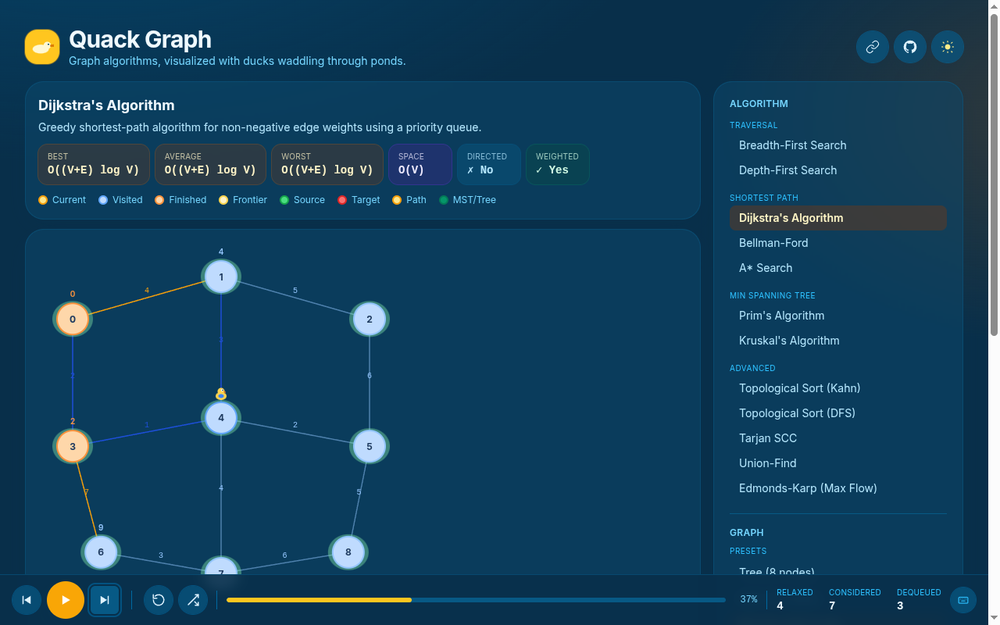

# Quack Graph 🦆

[](https://github.com/Joaolfelicio/quack-graph/actions/workflows/deploy.yml)
[](https://opensource.org/licenses/MIT)

## 🚀 Live Demo
**Play now:** [https://joaolfelicio.github.io/quack-graph/](https://joaolfelicio.github.io/quack-graph/)

Graph algorithms, visualized with ducks waddling through ponds.

Nodes are lily pads, edges are streams, and a duck mascot waddles along each traversal step in real time.



## Features

- **12 Graph Algorithms:** BFS, DFS, Dijkstra, Bellman-Ford, A\*, Prim, Kruskal, Topological Sort (Kahn & DFS), Tarjan SCC, Union-Find, and Edmonds-Karp Max Flow.
- **Interactive Controls:** Play, Pause, Step forward, Step back, Reset, and Regenerate graph.
- **Graph Variety:** 8 hand-authored presets (tree, DAG, weighted mesh, negative cycle, grid, SCC, flow network, disconnected) plus a seeded random generator.
- **URL-Shareable State:** Algorithm, graph, and speed are synced to the URL — paste to share exact state.
- **Educational:** Complexity badges (best / average / worst / space) and directed / weighted indicators per algorithm. Color-coded node and edge roles with in-page legend.
- **Live Stats:** Per-algorithm counters (visited, enqueued, relaxed, MST edges, flow, etc.) and elapsed time.
- **Accessible & Customizable:** Dark mode (persisted in `localStorage`), keyboard shortcuts (Space / ←→ / R), and optional WebAudio sound effects.

## Getting Started

```bash
# Install dependencies
npm install

# Start the Vite development server
npm run dev

# Run unit tests
npm test

# Build for production (outputs to dist/)
npm run build
```

## Adding a New Algorithm

1. Create `src/algorithms/<name>.ts`. Export a `GraphAlgorithm` object where `run` is a generator yielding `GraphEvent`s.
2. Register it in `src/algorithms/index.ts`.
3. Add a test in `src/algorithms/__tests__/graphs.test.ts` — the suite iterates the registry automatically.

## License

Distributed under the MIT License. See `LICENSE` for more information.
